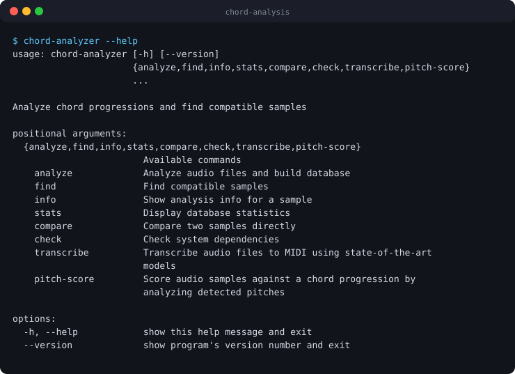

<p align="center">
  
</p>

# Chord Analysis & Sample Compatibility Matcher

<!-- BADGES:START -->


[](LICENSE.md)
[](CONTRIBUTING.md)
<!-- BADGES:END -->

## Table of Contents

- [Description](#description)
- [Screenshots](#screenshots)
- [Features](#features)
- [Requirements](#requirements)
- [Installation](#installation)
- [Usage](#usage)
  - [1. Check your setup](#1-check-your-setup)
  - [2. Extract chords from audio](#2-extract-chords-from-audio)
  - [3. Build the database](#3-build-the-database)
  - [4. Find compatible samples](#4-find-compatible-samples)
  - [Inspecting and comparing samples](#inspecting-and-comparing-samples)
  - [Scoring samples against a progression](#scoring-samples-against-a-progression)
  - [Transcribing audio to MIDI](#transcribing-audio-to-midi)
  - [The web UI](#the-web-ui)
  - [Using it from Python](#using-it-from-python)
  - [Command-line reference](#command-line-reference)
- [How Compatibility Is Scored](#how-compatibility-is-scored)
- [Architecture](#architecture)
- [Credits](#credits)
- [Contributing](#contributing)
- [License](#license)

## Description

A Python tool for music producers with large sample libraries. It works out the
chord progression, key and tempo of each sample, stores them in a database, and
then answers the question a producer actually has: **which other samples will
sound good with this one?**

Two samples can be compatible even when they are in different keys, because a
sample can be pitch-shifted, so matching is done on the *shape* of a progression
as well as its exact chords. The tool has a command-line interface, a Streamlit
web UI, and can also transcribe audio to MIDI.

## Screenshots

<p align="center">
  
</p>

<p align="center"><em>The command set: analyse a library, find compatible samples, compare two directly, transcribe to MIDI.</em></p>

The Streamlit web UI has no screenshot yet.

## Features

- **Chord extraction** from audio with Sonic Annotator and the Chordino plugin
- **Key and tempo from filenames**, such as `Funky_Bass_Cmaj_120bpm.wav`
- **Key detection** from the filename, or else by a weighted vote between the
  audio (Krumhansl-Kessler profiles over a chromagram) and the chords, with a
  confidence score
- **Mode detection** beyond major and minor: Dorian, Phrygian, Lydian,
  Mixolydian, Locrian, and harmonic and melodic minor
- **Key-agnostic matching**: C–F–G and G–C–D are both I–IV–V, so they are
  found as transpositions of each other, with the interval between them
- **Tempo and beat analysis**, so chord changes are compared by bar and beat,
  not just by seconds
- **A 0–100 compatibility score** built from six weighted factors, with an
  explanation of each
- **Pitch scoring**: rank a folder of samples against a chord progression you
  type in
- **Audio-to-MIDI transcription** with up to five backends
- **A SQLite database** that caches analysis and scores
- **A command-line interface** and a **Streamlit web UI** with a dashboard,
  sample browser, compatibility finder and side-by-side comparison

## Requirements

- **Python 3.9** or newer
- **libsndfile**, which librosa needs: `brew install libsndfile` on macOS, or
  `sudo apt-get install libsndfile1` on Debian and Ubuntu
- To extract chords from audio:
  - [Sonic Annotator](https://vamp-plugins.org/sonic-annotator/):
    `brew install sonic-annotator`, or `sudo apt-get install sonic-annotator`
  - the **Chordino** Vamp plugin, part of
    [NNLS Chroma](https://code.soundsoftware.ac.uk/projects/nnls-chroma/files),
    installed to `~/Library/Audio/Plug-Ins/Vamp/` on macOS or `~/.vamp/` on
    Linux
- For transcription, any of the optional backends listed in
  `requirements.txt` (`basic-pitch`, `piano_transcription_inference`, …), or
  **Docker** for the Magenta, Omnizart and MT3 backends

## Installation

```bash
git clone https://github.com/geoffmyers/chord-analysis.git
cd chord-analysis
python3 -m venv venv
source venv/bin/activate          # on Windows: venv\Scripts\activate
pip install -r requirements.txt
pip install -e .                  # optional: adds the chord-analyzer command
```

`./install.sh` does the same setup in one step, creating the virtual
environment if you are not already in one.

To use the Docker transcription backends, build their images locally. They are
not published to a registry.

```bash
docker compose -f docker/docker-compose.yml build          # all three
docker compose -f docker/docker-compose.yml build magenta  # or one: magenta, omnizart, mt3
```

If a transcription needs an image you have not built, the error names the
service to build. The MT3 build also tries to download its model checkpoints
(about 1.5 GB) from Google Cloud Storage.

## Usage

The examples use `python -m chord_analyzer`; after `pip install -e .`,
`chord-analyzer` works the same way.

### 1. Check your setup

```bash
python -m chord_analyzer check
```

This reports whether Sonic Annotator, Chordino, librosa, Rich and Docker are
available, and which transcription backends are installed.

### 2. Extract chords from audio

Let the tool call Sonic Annotator:

```bash
python -m chord_analyzer analyze \
    --audio-dir ~/Music/Samples \
    --csv-dir ./output/chord_data \
    --db ./output/samples.db \
    --extract
```

Folders are searched recursively unless you add `--no-recursive`. Or run
Sonic Annotator yourself and analyse its CSV files afterwards:

```bash
sonic-annotator -s vamp:nnls-chroma:chordino:simplechord > chordino.n3
sonic-annotator -t chordino.n3 ~/Music/Samples/*.wav -w csv --csv-basedir ./output/chord_data/
```

Chordino writes one CSV per sample:

```csv
start_time,end_time,chord_label
0.000000,0.500000,N
0.500000,2.000000,C:maj
2.000000,3.500000,A:min
3.500000,4.000000,F:maj
```

`N` means no chord, and labels read `root:type`, such as `C:maj`, `A:min7` or
`F#:dim`.

### 3. Build the database

```bash
# Detect tempo from the audio
python -m chord_analyzer analyze --csv-dir ./output/chord_data --db ./output/samples.db --detect-tempo

# Or state it
python -m chord_analyzer analyze --csv-dir ./output/chord_data --db ./output/samples.db --bpm 120 --time-sig 4/4
```

Tempo is taken from, in order: `--bpm`, the filename (`120bpm`, `120BPM`,
`120 bpm`), librosa's analysis of the audio, and finally an estimate from the
chord timing.

A key in the filename always wins, because it is someone's explicit label.
Filenames can carry keys such as `Cmaj`, `Am`, `F#m`, `Db Major` or `G minor`.
Without one, the audio (weight 0.3) and the chords (weight 0.1) vote, and
agreement between them raises the confidence.

### 4. Find compatible samples

```bash
python -m chord_analyzer find \
    --target ./output/chord_data/funky_bass_loop.csv \
    --db ./output/samples.db \
    --min-score 60 \
    --explain
```

Add `--use-rhythm` to compare where the chord changes fall in the bar, which
needs tempo data.

### Inspecting and comparing samples

```bash
python -m chord_analyzer info ./output/chord_data/funky_bass_loop.csv
python -m chord_analyzer compare sample_a.csv sample_b.csv --verbose
python -m chord_analyzer stats --db ./output/samples.db
```

`info` shows a sample's key, tempo and chords by bar and beat:

```
Sample: funky_bass_loop
Duration: 8.0 seconds
Estimated Key: C major

Tempo Info:
  BPM: 120.0
  Time Signature: 4/4
  Total Bars: 4

Chord Progression:
  Bar 1, Beat 1: C:maj (2.0 beats)
  Bar 1, Beat 3: A:min (2.0 beats)
  Bar 2, Beat 1: F:maj (2.0 beats)
  Bar 2, Beat 3: G:7 (2.0 beats)
```

`stats` summarises the database: tempos, time signatures and samples per key.

### Scoring samples against a progression

`pitch-score` detects the pitches in each sample and ranks a folder against a
progression you give it, without needing Chordino:

```bash
python -m chord_analyzer pitch-score \
    --sample-dir ~/Music/Samples/Keys \
    --progression "Cmaj7:4 Am7:4 Fmaj7:2 G7:2" \
    --bpm 90 \
    --normalize \
    --explain
```

`--normalize` matches in any key and shows the transposition needed. Add
`--use-midi` to score existing MIDI transcriptions instead of the audio, which is
much faster.

### Transcribing audio to MIDI

```bash
python -m chord_analyzer transcribe --input ~/Music/Samples/Keys --recursive
python -m chord_analyzer transcribe --input loop.wav --backend basic_pitch
python -m chord_analyzer transcribe --input loop.wav --backend onsets_frames --use-docker
```

| Backend | Install | Good for |
|---|---|---|
| `basic_pitch` | `pip install basic-pitch` | Any instrument, polyphonic, with pitch bends |
| `piano_transcription` | `pip install piano_transcription_inference` | Piano; supports `--device cuda` |
| `onsets_frames` | Docker image (Magenta) | Piano |
| `omnizart` | Docker image | Music, drums or vocals (`--omnizart-mode`) |
| `mt3` | Docker image | Several instruments at once |

By default every installed backend is used, MIDI files are written beside the
audio, and a Docker image is tried when a native backend is missing.

### The web UI

```bash
./launch-web-ui.sh               # macOS and Linux
python launch_web_ui.py          # any platform
```

Both launchers create the virtual environment, install the dependencies, find
your database and open the UI at [http://localhost:8501](http://localhost:8501).
They accept `--db PATH`, `--port PORT`, `--host HOST` and `--no-browser`. See
[docs/QUICKSTART.md](docs/QUICKSTART.md) for a walkthrough and
[docs/LAUNCHER_README.md](docs/LAUNCHER_README.md) for the full launcher
reference (troubleshooting, `docs/LAUNCHER_COMPARISON.md` for choosing
between the two launchers and a manual `streamlit run`).

The web UI ships with `.streamlit/config.toml`'s `showErrorDetails = false`,
so a crash shows a generic message rather than a stack trace and file paths.
To see the real traceback while debugging, run with
`streamlit run chord_analyzer/web_app.py --client.showErrorDetails=true`, or
flip the value in `.streamlit/config.toml` back to `true` locally (do not
commit it that way).

To run Streamlit yourself:

```bash
streamlit run chord_analyzer/web_app.py --server.port 8501
```

| Page | What it does |
|---|---|
| **Dashboard** | Database statistics, and key and tempo charts |
| **Sample Browser** | Search and filter samples by key, tempo or filename |
| **Find Compatible** | Pick a sample and see its matches with a score breakdown |
| **Compare Samples** | Two samples side by side |

### Using it from Python

```python
from chord_analyzer import (
    parse_filename,
    detect_key_from_chords,
    detect_scale_from_chords,
    is_transposition,
    get_transposition_interval,
    calculate_compatibility,
)

info = parse_filename("Funky_Bass_Cmaj_120bpm.wav")
print(info.key, info.bpm)                     # C major 120.0

chords = ["C:maj", "A:min", "F:maj", "G:7"]
print(detect_key_from_chords(chords))         # C major (55.6% confidence)
print(detect_scale_from_chords(chords, key_root="C").display_name)   # C Ionian

a = ["C:maj", "F:maj", "G:maj"]
b = ["G:maj", "C:maj", "D:maj"]
print(is_transposition(a, b), get_transposition_interval(a, b))      # True 7

result = calculate_compatibility(a, b)
print(result["overall"], result["transposition_note"])               # 79.6 G
```

`chord_analyzer/__init__.py` also exports the database functions
(`init_database`, `store_sample`, `find_compatible_samples`), the tempo tools
(`detect_tempo`, `BeatGrid`, `quantize_chords_to_beats`),
`calculate_compatibility_with_rhythm`, and the audio key and scale detectors.
`chord_analyzer.extractor.create_sample_from_csv_with_tempo` builds a sample from
a CSV and its audio file in one call.

### Command-line reference

| Command | Options |
|---|---|
| `analyze` | `--csv-dir DIR` (required), `--audio-dir DIR`, `--db PATH` (default `samples.db`), `--extract`, `--no-recursive`, `--bpm N`, `--detect-tempo`, `--time-sig 4/4` |
| `find` | `--target PATH` (required), `--db PATH`, `--min-score N` (default 50), `--limit N` (default 10), `--explain`, `--use-rhythm` |
| `info` | `FILEPATH`, `--db PATH` |
| `stats` | `--db PATH` |
| `compare` | `SAMPLE_A SAMPLE_B`, `-v, --verbose` |
| `check` | |
| `pitch-score` | `--sample-dir DIR` (required), `--progression TEXT` or `--progression-file JSON`, `--bpm N`, `--time-sig`, `--min-score N` (default 0), `--limit N` (default 20), `--no-recursive`, `--output table\|json\|csv`, `--explain`, `--mono`, `--poly`, `--use-midi`, `--midi-backend NAME`, `--no-midi-fallback`, `--midi-only`, `--normalize`, `--show-transposition`, `--merge-backends` |
| `transcribe` | `-i, --input PATH` (required), `-o, --output-dir DIR`, `-b, --backend NAME…`, `--device cpu\|cuda`, `--omnizart-mode music\|drum\|vocal`, `-r, --recursive`, `--overwrite`, `-w, --workers N`, `--onset-threshold`, `--frame-threshold`, `--min-note-length`, `--multiple-pitch-bends`, `--no-melodia-trick`, `--use-docker`, `--no-docker-fallback`, `--docker-timeout SECONDS` |

Run any command with `--help` for the full descriptions.

## How Compatibility Is Scored

| Factor | Up to | What it measures |
|---|---|---|
| **Functional match** | 35 | The same progression shape in any key, so transpositions score fully |
| Shared chords | 20 | Chords the two samples have in common |
| Note overlap | 15 | Common notes, a sign of compatible scales |
| Harmonic relations | 15 | Circle-of-fifths relationships (fourths, fifths, unisons) |
| Mood match | 15 | A similar balance of major and minor |
| Rhythm match | 15 | Chord changes on the same beats, with `--use-rhythm` |
| Clash penalty | −15 | Notes a semitone apart, which clash |

The total is clamped to **0–100**. Because the functional match ignores key, a
progression and its transposition are recognised as the same idea, which matters
because a sample can be pitch-shifted to fit. With tempo data, chord lengths and
change points are compared in beats rather than seconds, so two samples with the
same feel match even at different tempos.

## Architecture

```
audio ──► Sonic Annotator + Chordino ──► chord CSVs ──┐
audio ──► librosa (tempo, key, pitch) ─────────────────┤
filenames ──► filename_parser ─────────────────────────┤
                                                       ▼
                                   extractor ──► database (SQLite)
                                                       │
                          compatibility / pitch_compatibility
                                                       │
                          cli.py (analyze, find, info, …)   web_app.py (Streamlit)
```

| Path | Role |
|---|---|
| `chord_analyzer/cli.py`, `__main__.py` | The command-line interface |
| `chord_analyzer/extractor.py` | Reads chord CSVs, runs Sonic Annotator, applies beat grids |
| `chord_analyzer/theory.py` | Chord parsing, intervals, roman numerals and transposition |
| `chord_analyzer/voicing.py` | Whether a sample is monophonic or polyphonic |
| `chord_analyzer/key_detection.py`, `tempo.py`, `filename_parser.py` | Key, mode and tempo |
| `chord_analyzer/compatibility.py` | The scoring engine |
| `chord_analyzer/pitch_detector.py`, `progression_parser.py`, `pitch_compatibility.py` | `pitch-score` |
| `chord_analyzer/midi_transcriber.py` | `transcribe` and its backends |
| `chord_analyzer/database.py`, `models.py` | SQLite storage, with a cache of computed scores, and the data model |
| `chord_analyzer/web_app.py` | The Streamlit UI (`run_web.py` is an alternative entry point) |
| `docker/` | Dockerfiles and a compose file for the Magenta, Omnizart and MT3 backends |
| `rebuild_database.py`, `migrate_*.py` | Maintenance scripts for an existing database |
| `tests/` | The pytest suite |
| `docs/` | Quick start, design plan, roadmap and research notes |

See [ARCHITECTURE.md](ARCHITECTURE.md) for more detail, and
[docs/DESIGN_PLAN.md](docs/DESIGN_PLAN.md) and [docs/ROADMAP.md](docs/ROADMAP.md)
for where the project is going.

## Credits

- Audio analysis by [librosa](https://librosa.org/),
  [soundfile](https://python-soundfile.readthedocs.io/),
  [pydub](https://github.com/jiaaro/pydub) and
  [pretty_midi](https://craffel.github.io/pretty-midi/), on
  [NumPy](https://numpy.org/); the web UI by [Streamlit](https://streamlit.io/),
  [pandas](https://pandas.pydata.org/), [Matplotlib](https://matplotlib.org/)
  and [Pillow](https://python-pillow.org/); terminal output by
  [Rich](https://rich.readthedocs.io/).
- Chord extraction by [Sonic Annotator](https://vamp-plugins.org/sonic-annotator/)
  and the Chordino plugin from
  [NNLS Chroma](https://code.soundsoftware.ac.uk/projects/nnls-chroma), by
  Matthias Mauch.
- Key profiles from the work of Krumhansl and Kessler.
- Transcription backends: Spotify's
  [Basic Pitch](https://github.com/spotify/basic-pitch), ByteDance's
  [piano transcription](https://github.com/qiuqiangkong/piano_transcription_inference),
  Google Magenta's [Onsets and Frames](https://github.com/magenta/magenta) and
  [MT3](https://github.com/magenta/mt3), and
  [Omnizart](https://github.com/Music-and-Culture-Technology-Lab/omnizart).
  Each is installed separately and keeps its own licence.
- The README icon is the [Font Awesome](https://fontawesome.com/) `guitar` glyph,
  used under [CC BY 4.0](https://creativecommons.org/licenses/by/4.0/).

Written by Geoff Myers.

## Contributing

Bug reports and pull requests are welcome. See [CONTRIBUTING.md](CONTRIBUTING.md)
for setup, checks and how this repository is published.

```bash
pytest tests/
pytest tests/ --cov=chord_analyzer --cov-report=term-missing
```

## License

This program is free software: you can redistribute it and/or modify it under
the terms of the GNU General Public License as published by the Free Software
Foundation, either version 3 of the License, or (at your option) any later
version.

This program is distributed in the hope that it will be useful, but WITHOUT ANY
WARRANTY; without even the implied warranty of MERCHANTABILITY or FITNESS FOR A
PARTICULAR PURPOSE. See [LICENSE.md](LICENSE.md) for the full text of the GNU
General Public License.

SPDX-License-Identifier: `GPL-3.0-or-later`
